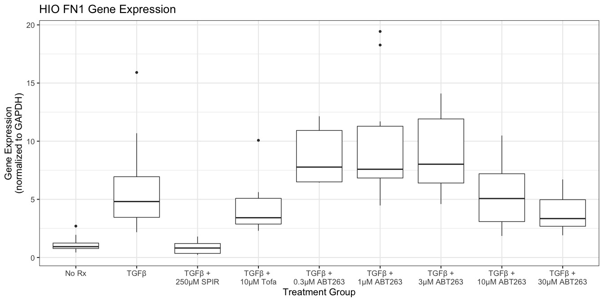

plot\_functions
================
Peter Higgins
11/18/2019

## First Plot

This is an R Markdown document. Markdown is a simple formatting syntax
for authoring HTML, PDF, and MS Word documents. For more details on
using R Markdown see <http://rmarkdown.rstudio.com>.

When you click the **Knit** button a document will be generated that
includes both content as well as the output of any embedded R code
chunks within the document. You can embed an R code chunk like this:

``` r
tidyproteins %>% 
  filter(protein == "sma") %>% 
  ggplot(aes(x= as.factor(category), y = norm_densitometry) ) +
  geom_boxplot() +
  geom_signif(y_position = 1.3,comparisons = list(c("1", "2")), test="t.test", textsize = 5) +
  geom_signif(y_position = 1.5,comparisons = list(c("1", "6")),          
              test="t.test", textsize = 5) +
  geom_signif(y_position = 1.7,comparisons = list(c("1", "7")),          
              test="t.test", textsize = 5)+
  scale_x_discrete(labels = c("1" = "TGFβ", 
                              "2" = "TGFβ +\n250\U03BCM SPIR",
                              "3" = "TGFβ +\n10\U03BCM Tofa",
                              "4" = "TGFβ +\n1\U03BCM ABT263",
                              "5" = "TGFβ +\n3\U03BCM ABT263",
                              "6" = "TGFβ +\n10\U03BCM ABT263",
                              "7" = "TGFβ +\n30\U03BCM ABT263")) +
  labs(y = "band densitometry\n(normalized to GAPDH)", 
       x = "Treatment Group",
       title = "HIO αSMA Protein Expression") +
  theme(legend.position = "none", 
        plot.title = element_text(face="bold")) +
  theme_bw(base_size = 16) 
```

<!-- -->

## Making a Plot Function

You can save any pipe as a function, once you identify the unique
arguments. In this case, your arguments are

1.  data
2.  filtering variable (protein) = \[filter\_var\]
3.  category/group = \[cat\_var\]
4.  continuous result (densitometry) = \[result\_var\]

<!-- end list -->

``` r
plot_func <- function(data, filter_var, cat_var, result_var){ 
  data %>% 
  filter(protein == {{filter_var}}) %>% 
  ggplot(aes(x= as.factor({{cat_var}}), y = {{result_var}})) +
  geom_boxplot() +
  geom_signif(y_position = 1.3,comparisons = list(c("1", "2")), test="t.test", textsize = 5) +
  geom_signif(y_position = 1.5,comparisons = list(c("1", "6")),          
              test="t.test", textsize = 5) +
  geom_signif(y_position = 1.7,comparisons = list(c("1", "7")),          
              test="t.test", textsize = 5)+
  scale_x_discrete(labels = c("1" = "TGFβ", 
                              "2" = "TGFβ +\n250\U03BCM SPIR",
                              "3" = "TGFβ +\n10\U03BCM Tofa",
                              "4" = "TGFβ +\n1\U03BCM ABT263",
                              "5" = "TGFβ +\n3\U03BCM ABT263",
                              "6" = "TGFβ +\n10\U03BCM ABT263",
                              "7" = "TGFβ +\n30\U03BCM ABT263")) +
  labs(y = "band densitometry\n(normalized to GAPDH)", 
       x = "Treatment Group",
       title = "HIO αSMA Protein Expression") +
  theme(legend.position = "none", 
        plot.title = element_text(face="bold")) +
  theme_bw(base_size = 16) 
}
```

Now you can use plot\_func with arguments

``` r
plot_func(tidyproteins, 'sma', category, norm_densitometry)
```

<!-- -->

Let’s try this with genes

``` r
tidygenes %>% 
  filter(gene == "col1a1") %>% 
  ggplot(aes(x= as.factor(category), y = fold) ) +
  geom_boxplot() +
  geom_signif(y_position = 5,comparisons = list(c("1", "2")), test="t.test", textsize = 5) +
  geom_signif(y_position = 7.5,comparisons = list(c("2", "8")),          
              test="t.test", textsize = 5) +
  geom_signif(y_position = 10,comparisons = list(c("2", "9")),          
              test="t.test", textsize = 5)+
  scale_x_discrete(labels = c("1" = "No Rx", 
                              "2" = "TGFβ",
                              "3" = "TGFβ +\n250\U03BCM SPIR",
                              "4" = "TGFβ + \n10\U03BCM Tofa",
                              "5" = "TGFβ +\n0.3\U03BCM ABT263",
                              "6" = "TGFβ +\n1\U03BCM ABT263",
                              "7" = "TGFβ +\n3\U03BCM ABT263",
                              "8" = "TGFβ +\n10\U03BCM ABT263",
                              "9" = "TGFβ +\n30\U03BCM ABT263")) +
  labs(y = "Gene Expression\n(normalized to GAPDH)", 
       x = "Treatment Group",
       "HIO Collagen 1 Gene Expression") +
  theme(legend.position = "none", 
        plot.title = element_text(face="bold")) +
  theme_bw(base_size = 16) 
```

<!-- -->

## Making a New Plot Function

You can save any pipe as a function, once you identify the unique
arguments. In this case, your arguments are

1.  data
2.  filtering variable (gene) = \[filter\_var\]
3.  category/group = \[cat\_var\]
4.  continuous result (densitometry) = \[result\_var\]

<!-- end list -->

``` r
plot_gene <- function(data, filter_var, cat_var, result_var){ 
  data %>% 
  filter(gene == {{filter_var}}) %>% 
  ggplot(aes(x= as.factor({{cat_var}}), y = {{result_var}})) +
  geom_boxplot() +
  geom_signif(y_position = 5,comparisons = list(c("1", "2")), test="t.test", textsize = 5) +
  geom_signif(y_position = 7.5,comparisons = list(c("2", "8")),          
              test="t.test", textsize = 5) +
  geom_signif(y_position = 10,comparisons = list(c("2", "9")),          
              test="t.test", textsize = 5)+
  scale_x_discrete(labels = c("1" = "No Rx", 
                              "2" = "TGFβ",
                              "3" = "TGFβ +\n250\U03BCM SPIR",
                              "4" = "TGFβ + \n10\U03BCM Tofa",
                              "5" = "TGFβ +\n0.3\U03BCM ABT263",
                              "6" = "TGFβ +\n1\U03BCM ABT263",
                              "7" = "TGFβ +\n3\U03BCM ABT263",
                              "8" = "TGFβ +\n10\U03BCM ABT263",
                              "9" = "TGFβ +\n30\U03BCM ABT263")) +
  labs(y = "Gene Expression\n(normalized to GAPDH)", 
       x = "Treatment Group",
       "HIO Collagen 1 Gene Expression") +
  theme(legend.position = "none", 
        plot.title = element_text(face="bold")) +
  theme_bw(base_size = 16) 
}
```

Now run the function below. Then replace the filter var with one of

1.  ‘mylk’
2.  ‘fn1’
3.  ‘acta2’

There are a few problems

1.  The title is not right/does not change
2.  The y\_position of p values is problematic
3.  Type of cells, amount of TGFb, time duration, N replicates not
    stated

<!-- end list -->

``` r
plot_gene(data = tidygenes, filter_var = 'acta2', 
          cat_var = category, result_var =  fold)
```

<!-- -->

You can over-write the title, and add a caption

``` r
plot_gene(data = tidygenes, filter_var = 'acta2', 
          cat_var = category, result_var =  fold) +
  labs(title = "HIO Acta2 Gene Expression",
       caption = "Human intestinal Organoids incubated for 72 h\nwith 250\U03BCM TGFβ, 3 replicates")
```

<!-- -->

Now try a lean function

Now try this with ‘fn1’

``` r
plot_gene_lean(tidygenes, 'fn1',
               category, fold)
```

<!-- -->
